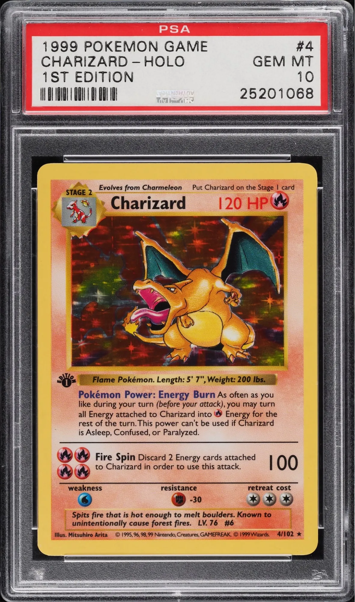

```{r setup, include=FALSE}
knitr::opts_chunk$set(echo = TRUE)
```

```{r,echo=FALSE}
setwd("C:/Users/kevin/OneDrive/Documents/Projects/Data Science/Pokemon")
```


# Introduction

In 1996, Satoshi Tajiri released the video game, “Pokémon,” on the Game Boy. The core concept centered around fantasy-like creatures called Pokémon that humans caught and trained for battle. The trainer with the strongest team was dubbed the Pokémon Master. Over the decades, the simple game has experienced a monumental growth into a massive franchise, with animated series, movies, mobile games, merchandise, theme parks, and the largest trading card game in history. 

The Pokémon Trading Card Game (TCG) launched shortly after its first game did. By allowing players to collect, trade, and battle with cards that represented different Pokémon, the TCG gave people an opportunity to become a Trainer in real life. While the competitive aspect of the TCG maintains a dedicated community, collecting has achieved an overwhelming mainstream success with a reported "3.7 billion Pokémon cards sold worldwide in fiscal year 2020/2021," according to [Cole 2024](https://blockapps.net/blog/the-role-of-pokemon-tcg-in-the-broader-trading-card-market/#The_Trading_Card_Game_Market_A_Booming_Industry).

However, Pokémon cards have branched from a mere collectible to an alternative investment asset for some people, due to several cards appreciating dramatically in value. 

```{r, echo=FALSE, out.width="40%", fig.align="center", fig.cap="First Edition Shadowless Holographic Charizard (1999) Sold for $420,000 on March 2022"}

```

High-profile auctions, increased media attention, and the surge of nostalgia-fueled demand have made Pokémon cards a legitimate marketplace for commerce. As a result, understanding what makes a card valuable, such as rarity, condition, featured Pokémon, and release date, has become critical for anyone involved in this space.

In this project, I aim to build a machine learning model that will accurately predict the price value of Pokémon cards, given its attributes. I will employ a series of machine learning models and discern the most effective one.

# Loading Packages

```{r, message = FALSE}
library(readr)
library(corrplot)
library(jsonlite)
library(ggplot2)
library(dplyr)
library(tinytex)
library(tidymodels)
library(tidyverse)
library(ggplot2)
library(scales)
library(gridExtra)
library(DT)
library(xgboost)
library(kableExtra)
library(vip)
library(janitor)
library(stringr)
```


# The Dataset

I found a [Kaggle dataset](https://www.kaggle.com/datasets/adampq/pokemon-tcg-all-cards-1999-2023) that contains comprehensive information on every Pokémon card released from 1999 to 2023. However, it did not include the market price of each card, so we will need to collect that data separately. Thus,the data collection step is divided into two parts: creating the complete raw dataset in Python and preparing it in R.

### Python Script

To gather the market price of each and every Pokémon card, I utilized the [Pokémon TCG Developer Portal](https://dev.pokemontcg.io/). I had difficulty working with the API directly in R, so I asked Claude AI to create a separate working script in Python to source prices. I merged the prices by ID to the Kaggle dataset to attain a raw dataset with all relevant information.

```{r, message=FALSE}
cards <- read_csv('Data/pokemon-tcg-data-master 1999-2023.csv')

# Extract listed set names for Python program to search

names <- unique(cards$set)
json_string <- paste0("[", paste0('"', names, '"', collapse = ", \n"), "]")

# Prices were extracted in 2 parts in case of errors

prices1 <- read_csv('Data/PART1_20250501_180840.csv')
prices2 <- read_csv('Data/PART2_20250502_131204.csv')

prices_total <- rbind(prices1, prices2)

total <- merge(cards, prices_total, by='id')

# Selecting predictors of interest and the response variable, price

pokemon_data = subset(total, select =
                      c("set.x",
                        "series",
                        "release_date",
                        "artist",
                        "name.x",
                        "supertype",
                        "rarity.y",
                        "condition",
                        "price"))
```

### Cleaning the Data in R

After compiling the raw dataset and selecting the initial variables of interest, I tidied the variable names to make it easier to work with.

```{r}
pokemon_data <- pokemon_data %>%
  # Convert date to proper date format
  mutate(release_date = as.Date(release_date, format = "%m/%d/%Y")) %>%
  
  # Fix column names that have .x and .y suffixes
  rename(
    set = set.x,
    name = name.x,
    rarity = rarity.y
  )

summary(pokemon_data)
```

When looking at the summary statistics of our initial dataset, we see that there are 27,317 observations. An important detail to highlight when looking at the price summary is that the median card price is $0.77. While a handful cards may be worth a few thousand, most cards hold very little value.

Moving on, I checked for any missing values. 

```{r}
missing_values <- colSums(is.na(pokemon_data))
print(missing_values)
```

We see that `rarity` and `artist` have missing values. After taking a quick look at those specific instances, I found that this occurs when Pokémon cards are created in unique collaborations (such as with McDonald's). Since this falls out of the scope of my analysis, I will be removing those observations from the dataset.


```{r}
pokemon_data <- pokemon_data %>% 
  filter(
    !is.na(rarity),
    !is.na(artist)
    )
```

Additionally, we are not interested in predicting the price of cards that typically hold little to zero value. Thus, I will also be removing observations that have either "Common" or "Uncommon" rarity. As a result, the number of observations in our dataset decreases by nearly 16,000, which will help make future model tuning less time-consuming. 

```{r}
pokemon_data <- pokemon_data %>% 
  filter(
    !rarity %in% c("Common", "Uncommon")
  )

nrow(pokemon_data)
```

In our analysis, We want to see how the card's featured Pokémon impacts its price. However, it is not exclusively mentioned in `name`. Though some card names only have the name of the Pokémon, which is exactly what we want, other card variants have additional text modifiers:

```{r}
unique(pokemon_data$name[grepl("charizard", pokemon_data$name, ignore.case = TRUE)])
```

We want to create a new column that only has the name of the Pokémon featured in the card for our analysis. To do this, I imported a [dataset from GitHub](https://github.com/lgreski/pokemonData/blob/master/Pokemon.csv) of all the existing Pokémon names and matched it with `name`. 

```{r, eval = FALSE}
## Creating a base names column
pokemon_base_names <- read_csv("Data/pokemon_base_names.csv")
pokemon_base_names <- clean_names(pokemon_base_names)

extract_base_name <- function(card_name, base_names) {
  matches <- base_names[sapply(base_names,
                               function(x) grepl(x, card_name, ignore.case = TRUE))]
  if (length(matches) == 0) 
    return(NA)
  matches[which.max(nchar(matches))]
}

pokemon_data$base_name <- ifelse(
  tolower(pokemon_data$supertype) %in% c("trainer", "energy"),
  pokemon_data$name,
  sapply(pokemon_data$name, extract_base_name, base_names = pokemon_base_names$name)
)
```

It is worth mentioning that Pokémon cards have three different types: Pokémon, Trainer, and Energy. Since there are so many unique names for Trainers and Energy, there is no point in matching their names. Thus, we will simply be keeping their original card name.

```{r, eval=FALSE, echo = FALSE}
# Checking for any missing names
pokemon_data[is.na(pokemon_data$base_name), ]
```

We will also be transforming `release_date` to `card_age`, a numerical variable for the number of years the card has been released for.

```{r}
pokemon_data$card_age = floor(as.numeric((difftime(Sys.Date(), pokemon_data$release_date, units = "days")) / 365.25))
```

```{r, eval = FALSE, echo = FALSE}
write.csv(pokemon_data, "Data/pokemon_data_cleaned.csv", row.names = FALSE)
```

### Explaining our Predictors

```{r, echo=FALSE}
pokemon_data <- read.csv("Data/pokemon_data_cleaned.csv")
pokemon_data$release_date <- as.Date(pokemon_data$release_date)
```


After removing unnecessary variables and creating integral ones, we have our final predictor variables. The predictors that in our dataset are:

- `set`: The specific expansion set that the card belongs to
- `series`: The broader series that sets are grouped under.
- `artist`: The name of the illustrator who drew the card's art.
- `supertype`: Denotes whether the card is a Pokémon, Trainer, or Energy.
- `rarity`: Indicates how rare a card is within its set.
- `condition`: Describes the physical version of the card.
- `price`: Our outcome variable. It is the resale market price of the card that is listed by TCG Player, the most popular platform where TCG cards are sold.
- `base_name`: The name of the Pokémon that is featured on the card.
- `card_age`: The number of years since the card has been released.

```{r}
summary(pokemon_data)
```

Our dataset has 11437 individual cards. From the summary statistics on `price`, it appears that the cards are generally not worth much. The cheapest card is \$0.05 and the median card price is \$3.12. Yet, the most expensive card is worth \$2499.99 and the mean is \$21.98. The vast difference between the median and mean likely signifies that there are several high-cost outliers that are causing a right skew. It is also interesting to note that the median for `card_age` is 8 while the max is 26. This would mean that more cards have been released recently, which is why the median is not 13.

# Exploratory Data Analysis (EDA)

We will now explore the relationships between our predictor and outcome variable.

### 1. Price Distribution

```{r, fig.width=12, fig.height=8}
price_histogram <- ggplot(pokemon_data, aes(x = price)) +
  geom_histogram(bins = 30, fill = "steelblue", color = "white") +
  scale_x_log10(labels = dollar_format()) +
  labs(title = "Distribution of Pokémon Card Prices (Log Scale)",
       x = "Price",
       y = "Count") +
  theme_minimal()

price_histogram
```

From running our summary statistics, we know that the majority of card prices are low, while there are only a small handful of large outliers. Thus, it is more effective to graph the price distribution on a log scale. Our plot verifies our inital assumption by showing most cards are worth less than \$10. However, we still see that there are several hundred cards worth \$100+. That is why it is important to be able to predict the price of Pokémon cards.

### 2. Price by Popularity
```{r, fig.width=12, fig.height=8}
top_pokemon <- pokemon_data %>%
  group_by(base_name) %>%
  summarize(
    median_price = median(price, na.rm = TRUE),
    card_count = n()
  ) %>%
  arrange(desc(median_price)) %>%
  filter(card_count >= 10) %>% 
  head(10)

popularity_plot <- top_pokemon %>% 
  ggplot(aes(x=reorder(base_name, median_price), y = median_price)) +
  geom_bar(stat = "identity", fill = "brown2") +
  geom_text(aes(label = paste0("$", round(median_price, 2))), 
            hjust = -0.1, 
            size = 3.5) +
  coord_flip() +
  labs(title = "Top 10 Pokemon by Median Card Price",
       x = "Set",
       y = "Median Price") +
  theme_minimal()

popularity_plot
```

One of the things that we are interested in looking at is if the Pokémon featured on the card has an influence on the price. After seeing that the distribution of prices in the previous plot, we know that most cards are not worth much. However, this plot shows that certain Pokémon have a very high median price in contrast. Charizard cards have a median price of \$61.48 while the median price for cards overall is \$3.12. This seems to indicate that the Pokémon featured on the card does have an effect on the price

### 3. Price by Rarity


```{r, fig.width=12, fig.height=8}
price_by_rarity <- pokemon_data %>%
  group_by(rarity) %>%
  summarize(
    median_price = median(price, na.rm = TRUE),
    mean_price = mean(price, na.rm = TRUE),
    count = n()
  ) %>%
  arrange(desc(median_price))

rarity_plot <- ggplot(price_by_rarity, aes(x = reorder(rarity, median_price), 
                                           y = median_price)) +
  geom_bar(stat = "identity", fill = "steelblue") +
  geom_text(aes(label = paste0("$", round(median_price, 2))), 
            hjust = -0.1, 
            size = 3.5) +
  coord_flip() +
  labs(title = "Median Price by Rarity",
       x = "Rarity",
       y = "Median Price") +
  theme_minimal()

rarity_plot
```

From our plot, we can see that there exists several rarity levels. Some rarities only appear in certain sets or series, which can explain why "Rare Holo Star" and "Rare Shining" have a much higher median price compared to others Meanwhile, rarity levels that appear in every set, such as "Rare" only has a median price of \$0.96.

### 4. Price by Condition

```{r, fig.width=12, fig.height=8}
price_by_condition <- pokemon_data %>%
  group_by(condition) %>%
  summarize(
    median_price = median(price, na.rm = TRUE),
    count = n()
  )

condition_plot <- price_by_condition %>% 
  ggplot(aes(x = reorder(condition, median_price), y = median_price)) +
  geom_bar(stat = "identity", fill = "lightgreen") +
  geom_text(aes(label = paste0("$", round(median_price, 2))), 
            hjust = -0.1, 
            size = 3.5) +
  coord_flip() +
  labs(title = "Median Price by Card Condition",
       x = "Condition",
       y = "Median Price") +
  theme_minimal()

condition_plot
```

The condition of the card is similar to a second layer of rarity. A Rare card with a normal condition would be worth less than the same Rare card but as a 1st Edition. With this understanding, the results from our plot is what we would expect, where rarer conditions have a higher median price.


### 5. Price Trends Over Time
```{r, fig.width=12, fig.height=8}
time_trend <- pokemon_data %>%
  mutate(release_month = floor_date(release_date, "month")) %>%
  group_by(release_month) %>%
  summarize(
    median_price = median(price, na.rm = TRUE),
    count = n()
  ) %>%
  ggplot(aes(x = release_month, y = median_price)) +
  geom_line(color = "darkblue") +
  geom_point(color = "darkblue", size = 1) +
  scale_x_date(date_labels = "%b %Y", date_breaks = "1 year") +
  labs(title = "Median Price Trend Over Time",
       x = "Release Date",
       y = "Median Price") +
  theme_minimal() +
  theme(axis.text.x = element_text(angle = 45, hjust = 1))

time_trend
```

The plot above shows the median price of cards year over year. We see an overall, negative trend where cards are worth more the older they are. The median price of cards that have come out in the past decade are worth less than a few dollars. In contrast, the median price of cards that were released from 1998 to 2008 was typically above \$20. Extreme spikes in the graph can be attributed to popular sets that were released in that period.

### 6. Price by Artist

```{r, fig.width=12, fig.height=8}
price_by_artist <- pokemon_data %>%
  group_by(artist) %>%
  summarize(
    median_price = median(price, na.rm = TRUE),
    count = n()
  ) %>%
  filter(count >= 20) %>%  
  arrange(desc(median_price)) %>%
  head(10)

artist_plot <- price_by_artist %>% 
  ggplot(aes(x = reorder(artist, median_price), y = median_price)) +
  geom_bar(stat = "identity", fill = "purple") +
  geom_text(aes(label = paste0("$", round(median_price, 2))), 
            hjust = -0.1, 
            size = 3.5) +
  coord_flip() +
  labs(title = "Top 10 Artists by Median Card Price",
       x = "Artist",
       y = "Median Price") +
  theme_minimal()

artist_plot
```

The purpose of this plot is similar to our second plot where we looked at the relationsihp between the Pokémon featured on the card and its median price. Here, we are interested in seeing if the artist who created the art on the card has an effect on the median price of the card. Their art styles or credibility may make a card more or less valuable. We see from the visualization that cards created by certain artists have a much higher median price than the overall median. Hikaru Koike typically products the most expensive cards.


### 7. Set Analysis

```{r, fig.width=12, fig.height=8}
price_by_set<- pokemon_data %>%
  group_by(set) %>%
  summarize(
    median_price = median(price, na.rm = TRUE),
    card_count = n()
  ) %>%
  arrange(desc(median_price)) %>%
  head(10)

set_plot <- price_by_set %>% 
  ggplot(aes(x = reorder(set, median_price), y = median_price)) +
  geom_bar(stat = "identity", fill = "darkgreen") +
  geom_text(aes(label = paste0("$", round(median_price, 2))), 
            hjust = -0.1, 
            size = 3.5) +
  coord_flip() +
  labs(title = "Top 10 Sets by Median Card Price",
       x = "Set",
       y = "Median Price (USD)") +
  theme_minimal()

set_plot
```

In this plot, we see that certain sets do appear to have a higher median price. Though, it is worth considering that it may only be due to the fact that these sets are older, which could be an influential factor as to why they are worth more.

### 8. Correlation Plot: Card Age vs. Price

```{r}
numeric_data <- pokemon_data %>%
  dplyr::select(where(is.numeric))
cor_matrix <- cor(numeric_data, use = "complete.obs")

corrplot(cor_matrix, type="lower",
         title = "Correlation Matrix of Numeric Variables")
```

We would expect from our earlier graph of median price trend over time that the greater the card age, the greater the price. However, we actually only see a very small positive correlation between the two numerical variables. This is likely due to the fact that there are so many observations within our dataset that may dampen the correlation.

# Setting Up the Models

After exploring our predictors and gaining a better understanding our dataset, we will begin setting up models to accurately predict the price of a Pokémon card. 

As a preliminary step, we must convert our character variables into factors for our model to work. Furthermore, we will perform a log transformation of our outcome variable to balance the right skew in our distribution and improve model performance.

```{r}
pokemon_data_updated <- pokemon_data %>% 
  mutate(price = log(price))

pokemon_clean <- pokemon_data_updated %>%
  mutate(
    # Categorical variables that should be factors
    set = as.factor(set),
    series = as.factor(series),
    artist = as.factor(artist),
    base_name = as.factor(base_name),
    supertype = as.factor(supertype),
    rarity = as.factor(rarity),
    condition = as.factor(condition),
    card_age = floor(as.numeric((difftime(Sys.Date(), release_date, units = "days")) / 365.25)),
  ) %>% 
  dplyr::select(-release_date, -name)
```


## Train / Test Split

The first step of our model fitting process is splitting our data into a training and testing set. We will be using the training set to train our models. We will then use our model on the testing set to see if it is able to carry a consistent performance in case of bias or overfitting.

We will split it such that 80% of the data will be used for training, while 20% will be for testing. We are stratifying our split based on the outcome variable, `price`, to ensure that the training and testing data have an equal distribution of `price`.

```{r}
set.seed(7777)

pokemon_split <- initial_split(pokemon_clean, prop = 0.8, strata = price)

pokemon_train <- training(pokemon_split)
pokemon_test <- testing(pokemon_split)
```

Dimensions of our Pokémon training dataset:

```{r}
dim(pokemon_train)
```

Dimensions of our Pokémon testing dataset:

```{r}
dim(pokemon_test)
```

## Building the Recipe

For our model fitting purposes, we will create a recipe that they can use for preprocessing. The model will be using `set`, `series`, `artist`, `supertype`, `rarity`, `condition`, `base_name`, and `card_age` as predictors.

- step_other() groups infrequently occurring Pokémon or artists into an "other" category to prevent overfitting to rare values.

- step_dummy() converts categorical variables into dummy variables.

- step_nzv() Removes predictors with variance that is close to 0 that will not be useful for modeling.

- step_lincomb() Removes exact linear combinations of predictors that might introduce multicollinearity.

- step_center() and step_scale() normalizes our variables


```{r}
pokemon_recipe <- recipe(price ~ ., data = pokemon_train) %>% 
  step_other(base_name, threshold = 0.0025) %>% 
  step_other(artist, threshold = 0.005) %>% 
  step_other(series, threshold = 0.01) %>% 
  step_dummy(set, series, artist, base_name, supertype,
             rarity, condition) %>% 
  step_nzv(all_predictors()) %>%
  step_lincomb(all_predictors()) %>% 
  step_scale(all_predictors()) %>%
  step_center(all_predictors())
```

## K-Fold Cross Valuation

We will be using k-fold cross validation, because it provides a more reliable estimate of model performance. The data is split into k folds. The model is trained on every fold except one which is where it is tested. This process is repeated k times, with each fold serving as the test set once. Finally, the model's root mean square error (RMSE), its performance, is averaged across all runs to produce a more stable and unbiased estimate of testing accuracy. 

Due to hardware limitations, we will only be using 5 folds to conduct k-fold cross validation. We will also be stratifying based on outcome again, so that each fold has an equal distribution of `price`.

```{r}
pokemon_folds <- vfold_cv(pokemon_train, v=5, strata = price)
```

# Model Building

We are now able to begin building our models. Going forward, we will be fitting 5 models to our dataset: Linear Regression, KNN, Elastic Net, Random Forest, and Boosted Trees. By comparing the models' highest $R^2$ across cross-validation folds, we will be able to determine which one performs the best.

As a side note, each model has a very similar process. Thus, I will only include the general description on what is being performed, rather than repeatedly describing the same thing for each model.

1. We set up the model by specifying the model we want to fit. We then include the parameters for each model that we want to tune, the engine the model comes from, and specifying that we are performing a regression.

```{r}
# Linear Regression
lm_model <- linear_reg() %>% 
  set_engine("lm")

# KNN
knn_mod_cv <- nearest_neighbor(neighbors = tune()) %>%
  set_mode("regression") %>%
  set_engine("kknn")

# Elastic Net
en_model <- linear_reg(mixture = tune(), 
                              penalty = tune()) %>%
  set_mode("regression") %>%
  set_engine("glmnet")

# Random Forest
rf_spec <- rand_forest(mtry = tune(), 
                           trees = tune(), 
                           min_n = tune()) %>%
  set_engine("ranger", importance = "impurity") %>% 
  set_mode("regression")


# BOOSTED TREES
boosted_spec <- boost_tree(trees = tune(),
                           learn_rate = tune(),
                           min_n = tune()) %>%
  set_engine("xgboost") %>%
  set_mode("regression")
```

2. Here, we set up the workflow and add the recipe we created before.

```{r}
# Linear Regression
lm_workflow <- workflow() %>% 
  add_model(lm_model) %>% 
  add_recipe(pokemon_recipe)

# KNN
knn_workflow_cv <- workflow() %>% 
  add_model(knn_mod_cv) %>% 
  add_recipe(pokemon_recipe)

# Elastic Net
en_workflow <- workflow() %>% 
  add_recipe(pokemon_recipe) %>% 
  add_model(en_model)

# Random Forest
rf_workflow <- workflow() %>% 
  add_model(rf_spec) %>% 
  add_recipe(pokemon_recipe)

# Boosted Trees
boosted_workflow <- workflow() %>% 
  add_recipe(pokemon_recipe) %>% 
  add_model(boosted_spec)
```

3. In this step, we create a tuning grid where we specify the ranges of the parameters and the levels that we want to test. These grids will be used during model tuning to try different combinations of parameters to find the configuration that results in the best performance.


```{r, eval = FALSE}
knn_grid <- grid_regular(neighbors(range = c(1, 10)), levels = 10)

en_grid <- grid_regular(penalty(),
                        mixture(range = c(0, 1)),
                             levels = 10)

rf_grid <- grid_regular(mtry(range = c(3, 18)), 
                        trees(range = c(400, 1000)),
                        min_n(range = c(5, 25)),
                        levels = 5)

boosted_grid <- grid_regular(trees(range = c(150, 400)), 
                             learn_rate(range = c(0.01,0.2), 
                                        trans = identity_trans()), 
                             min_n(range = c(20, 80)), 
                             levels = 5)
```


4. We use the previously defined tuning grids to find the best performing version of each model. This is done by training and validating them across multiple folds. Since linear regression does not require tuning, it is cross validated without a grid.


```{r,eval=FALSE}
# Linear Regression
# Fitting the linear regression to the folds first since it has no tuning

lm_fit <- fit_resamples(lm_workflow, resamples = pokemon_folds)

knn_res <- tune_grid(
  object = knn_workflow_cv, 
  resamples = pokemon_folds, 
  grid = knn_grid
)

en_res <- tune_grid(
  object = en_workflow,
  resamples = pokemon_folds,
  grid = en_grid
)

rf_tune_res <- tune_grid(
  rf_workflow,
  resamples = pokemon_folds,
  grid = rf_grid
)

boosted_tune_res <- tune_grid(
  boosted_workflow,
  resamples = pokemon_folds,
  grid = boosted_grid
)
```


5. We want to save the tuned models to an RDA file. This helps us avoid rerunning the models in the future.

```{r, eval=FALSE}
# Linear Regression
save(lm_fit, file="RDA/lm_res.rda")

# K Nearest Neighbor
save(knn_res, file="RDA/knn_res.rda")

# Elastic Net
save(en_res, file= "RDA/en_res.rda")

# Random Forest
save(rf_tune_res, file= "RDA/rf_tune_res.rda")

# Boosted Trees
save(boosted_tune_res, file= "RDA/boosted_tune_res.rda")
```


6. Load back the saved files.

```{r}
# Linear Regression
load(file="RDA/lm_res.rda")

# K Nearest Neighbor
load(file="RDA/knn_res.rda")

# Elastic Net
load(file="RDA/en_res.rda")

load(file= "RDA/rf_tune_res.rda")

load(file= "RDA/boosted_tune_res.rda")
```


# Model Results

We can now collect and compare the performance metrics from each of our tuned models. For each model, we will be interested in reviewing the RMSE and $R^2$ from cross validation. Furthermore, we want to check the training and testing $R^2$ of each best performing model to assess consistency and potential overfitting. Our primary metric for determining how well a model predicts the price of Pokémon cards is the $R^2$ across all cross-validation folds.


```{r}
#======================
### Best RMSE
#======================

# Linear Regression
lm_rmse <- collect_metrics(lm_fit) %>% 
  dplyr::slice(1)

# KNN
knn_rmse <- collect_metrics(knn_res) %>%
  filter(.metric == 'rmse') %>% 
  arrange(mean) %>% 
  dplyr::slice(1)

# Elastic Net
en_rmse <- collect_metrics(en_res) %>%
  filter(.metric == 'rmse') %>% 
  arrange(mean) %>% 
  dplyr::slice(1)

# Random Forest
rf_rmse <- collect_metrics(rf_tune_res) %>% 
  filter(.metric == 'rmse') %>% 
  arrange(mean) %>% 
  dplyr::slice(1)

# Boosted Trees
boosted_rmse <- collect_metrics(boosted_tune_res) %>% 
  filter(.metric == 'rmse') %>% 
  arrange(mean) %>% 
  dplyr::slice(1)


#======================
# Cross Validation R^2
#======================

# Linear Regression
lm_rsq <- collect_metrics(lm_fit) %>% 
  filter(.metric == 'rsq')

# KNN
best_knn_params <- collect_metrics(knn_res) %>%
  filter(.metric == 'rmse') %>% 
  arrange(mean) %>% 
  dplyr::slice(1) %>%
  select(neighbors)

knn_rsq <- collect_metrics(knn_res) %>%
  filter(.metric == 'rsq') %>%
  inner_join(best_knn_params, by = "neighbors")

# Elastic Net
best_en_params <- collect_metrics(en_res) %>%
  filter(.metric == 'rmse') %>% 
  arrange(mean) %>% 
  dplyr::slice(1) %>%
  select(penalty, mixture)

en_rsq <- collect_metrics(en_res) %>%
  filter(.metric == 'rsq') %>%
  inner_join(best_en_params, by = c("penalty", "mixture"))

# Random Forest
best_rf_params <- collect_metrics(rf_tune_res) %>% 
  filter(.metric == 'rmse') %>% 
  arrange(mean) %>% 
  dplyr::slice(1) %>%
  select(mtry, trees, min_n)

rf_rsq <- collect_metrics(rf_tune_res) %>% 
  filter(.metric == 'rsq') %>%
  inner_join(best_rf_params, by = c("mtry", "trees", "min_n"))

# Boosted Trees
best_boosted_params <- collect_metrics(boosted_tune_res) %>% 
  filter(.metric == 'rmse') %>% 
  arrange(mean) %>% 
  dplyr::slice(1) %>%
  select(trees, learn_rate, min_n)

boosted_rsq <- collect_metrics(boosted_tune_res) %>% 
  filter(.metric == 'rsq') %>%
  inner_join(best_boosted_params, by = c("trees", "learn_rate", "min_n"))

#======================
# Training R^2
#======================

# Linear Regression
lm_train_fit <- fit(lm_workflow, data = pokemon_train)
lm_train_pred <- predict(lm_train_fit, pokemon_train)
lm_train_results <- bind_cols(pokemon_train %>% select(price), lm_train_pred)
lm_train_rsq <- rsq(lm_train_results, truth = price, estimate = .pred)$.estimate

# KNN
best_knn <- select_best(knn_res, metric = 'rmse')
knn_final_workflow <- finalize_workflow(knn_workflow_cv, best_knn)
knn_train_fit <- fit(knn_final_workflow, data = pokemon_train)
knn_train_pred <- predict(knn_train_fit, pokemon_train)
knn_train_results <- bind_cols(pokemon_train %>% select(price), knn_train_pred)
knn_train_rsq <- rsq(knn_train_results, truth = price, estimate = .pred)$.estimate

# Elastic Net
best_en <- select_best(en_res, metric = 'rmse')
en_final_workflow <- finalize_workflow(en_workflow, best_en)
en_train_fit <- fit(en_final_workflow, data = pokemon_train)
en_train_pred <- predict(en_train_fit, pokemon_train)
en_train_results <- bind_cols(pokemon_train %>% select(price), en_train_pred)
en_train_rsq <- rsq(en_train_results, truth = price, estimate = .pred)$.estimate

# Random Forest
best_rf <- select_best(rf_tune_res, metric = 'rmse')
rf_final_workflow <- finalize_workflow(rf_workflow, best_rf)
rf_train_fit <- fit(rf_final_workflow, data = pokemon_train)
rf_train_pred <- predict(rf_train_fit, pokemon_train)
rf_train_results <- bind_cols(pokemon_train %>% select(price), rf_train_pred)
rf_train_rsq <- rsq(rf_train_results, truth = price, estimate = .pred)$.estimate

# Boosted Trees
best_boosted <- select_best(boosted_tune_res, metric = 'rmse')
boosted_final_workflow <- finalize_workflow(boosted_workflow, best_boosted)
boosted_train_fit <- fit(boosted_final_workflow, data = pokemon_train)
boosted_train_pred <- predict(boosted_train_fit, pokemon_train)
boosted_train_results <- bind_cols(pokemon_train %>% select(price), boosted_train_pred)
boosted_train_rsq <- rsq(boosted_train_results, truth = price, estimate = .pred)$.estimate

#======================
# Testing R^2
#======================

# Linear Regression
lm_test_pred <- predict(lm_train_fit, pokemon_test)
lm_test_results <- bind_cols(pokemon_test %>% select(price), lm_test_pred)
lm_test_rsq <- rsq(lm_test_results, truth = price, estimate = .pred)$.estimate

# KNN
knn_test_pred <- predict(knn_train_fit, pokemon_test)
knn_test_results <- bind_cols(pokemon_test %>% select(price), knn_test_pred)
knn_test_rsq <- rsq(knn_test_results, truth = price, estimate = .pred)$.estimate

# Elastic Net
en_test_pred <- predict(en_train_fit, pokemon_test)
en_test_results <- bind_cols(pokemon_test %>% select(price), en_test_pred)
en_test_rsq <- rsq(en_test_results, truth = price, estimate = .pred)$.estimate

# Random Forest
rf_test_pred <- predict(rf_train_fit, pokemon_test)
rf_test_results <- bind_cols(pokemon_test %>% select(price), rf_test_pred)
rf_test_rsq <- rsq(rf_test_results, truth = price, estimate = .pred)$.estimate

# Boosted Trees
boosted_test_pred <- predict(boosted_train_fit, pokemon_test)
boosted_test_results <- bind_cols(pokemon_test %>% select(price), boosted_test_pred)
boosted_test_rsq <- rsq(boosted_test_results, truth = price, estimate = .pred)$.estimate

#======================
# Results
#======================

results_table <- data.frame(
  Model = c("Linear Regression", "K Nearest Neighbors", "Elastic Net", "Random Forest", "Boosted Trees"),
  CV_RMSE = c(exp(lm_rmse$mean), exp(knn_rmse$mean), exp(en_rmse$mean), exp(rf_rmse$mean), exp(boosted_rmse$mean)),
  CV_R2 = c(lm_rsq$mean, knn_rsq$mean, en_rsq$mean, rf_rsq$mean, boosted_rsq$mean),
  Train_R2 = c(lm_train_rsq, knn_train_rsq, en_train_rsq, rf_train_rsq, boosted_train_rsq),
  Test_R2 = c(lm_test_rsq, knn_test_rsq, en_test_rsq, rf_test_rsq, boosted_test_rsq)
)

results_table <- results_table %>% arrange(desc(CV_R2))

kable(results_table, digits = 4) %>% 
  kable_styling(full_width = FALSE) %>%
  add_header_above(c(" " = 1, "Cross-Validation" = 2, "Final Models" = 2))
```

After compiling our results into the table above, we see that the Boosted Trees performed the best out of all of our models. Even though Random Forest had a greater testing $R^2$, Boosted Trees had the highest average $R^2$ across cross-validation folds. We prioritize cross-validation, because it evaluates the model on multiple training and testing splits. As a result, it produces a more stable estimate of how the model actually performs. There is not a big enough difference between the testing $R^2$ of the two models to influence our decision.

Additionally, the $R^2$ across our best model remains relatively consistent, which suggests that there is not serious overfitting. If our training $R^2$ was far greater than the testing or cross-validation $R^2$, then there would be a case of overfitting, which would make our results unreliable.

Lastly, we reverted the log transformation by exponentiating the RMSE. This improves our interpretation by telling us that the boosted trees price prediction is off by \$2.44 on average.


## Model Autoplots

We can use the autoplot function in R to visualize the effect of the tuned parameters on our models. For all models, a lower RMSE is better. 


```{r}
autoplot(en_res, metric = 'rmse') + theme_minimal()
```


```{r}
autoplot(rf_tune_res, metric = 'rmse') + theme_minimal()
```

```{r}
autoplot(boosted_tune_res, metric = 'rmse') + theme_minimal()
```

# Results of the Best Model

```{r}
boosted_train_fit %>% 
  extract_fit_engine() %>% 
  vip(aesthetics = list(fill = "red3", color = "blue3")) + theme_minimal()
```

From the Variable Importance Plot (VIP), we see that the variables that was best at predicting the outcome was card_age, followed by when the rarity level was "Rare." We would expect that card age would be a strong predictor from our EDA section. From the median price over time graph, we saw a clear trend where cards are worth more the older they are. Looking at the top predictors in our VIP, rarity and condition levels appear to be the most important for predicting the price of Pokémon cards.

One thing to note is that certain predictors, like the base name being Charizard or the artist of the card being Hikaru Koike, are not as important, even though we saw during the EDA that they were associated with expensive cards. It is likely they did not have as big of an overall impact since they only belonged to a few cards.


```{r}
pokemon_tibble <- predict(boosted_train_fit, new_data = pokemon_test)
pokemon_tibble <- bind_cols(pokemon_tibble, pokemon_test %>% select(price))

pokemon_tibble <- pokemon_tibble %>%
  mutate(.pred = exp(.pred),
         price = exp(price))

pokemon_tibble %>% 
  ggplot(aes(x = .pred, y = price)) +
  geom_point(alpha = 0.2, color = "red4") +
  geom_abline(linetype = "dashed", color = "black", linewidth = .6) +
  scale_x_log10(labels = scales::dollar_format()) +
  scale_y_log10(labels = scales::dollar_format()) +
  labs(
    title = "Boosted Tree: Predicted vs Actual Card Prices",
    x = "Predicted Price",
    y = "Actual Price",
  ) +
  theme_minimal()
```

By visualizing the predicted vs. actual price of our boosted trees model, we are able to better understand its performance. The dashed line represents the points at which our model is able to perfectly predict the actual price of cards. The more accurate our model is, the closer the dots are to the dashed line. We see that our model is more accurate when predicting the price of low-value cards compared to expensive cards. This is likely because price inflation is more volatile towards high-value cards, making it much harder to predict.


# Conclusion

This project successfully developed a machine learning model capable of predicting Pokémon TCG prices with high accuracy. Through comprehensive EDA and  model comparison, we were able to extract several key insights on factors that drive card values in the TCG market.

## Key Findings

The boosted trees model was the best performing predictor with a cross-validation RMSE of \$2.44 and $R^2$ of 0.7918. This indicates that our model can explain around 79% of the variance in card prices. The model's consistent performance across cross-validation, and the training and testing set of our tuned model suggests that there is little overfitting with reliable predictive capability.

Our analysis revealed that card age is the most influential factor in determining price, which reinforces the negative trend discovered during EDA of median price over release date. This aligns with our understanding of the collectors market that scarcity and nostalgia often drive price appreciation. Rarity and condition levels were also predominantly among the most important predictors.

While our EDA showed that certain Pokémon and specific artists were associated with higher median prices, these factors proved less influential in the overall model. This could suggest that these characteristics tend to create high-value outliers, but are not representative of the primary drivers of market value.


## Model Limitations

Our best performing model demonstrates strong predictive capability for cards valued under \$10, but shows diminished accuracy for expensive cards. This is seen in the predicted vs. actual price visualization. Yet, this limitation possibly exposes the heightened volatility and speculation present in the high-end TCG market. At this range, outside influence beyond a card's physical and intrinsic attributes, such as social media attention can dramatically influence prices.

Also, all of our models were constrained to conservative tuning grids due to the limitations of computing power that was available to me. Especially with the random forest and boosted trees model, further optimization is possible with an expanded grid. 


## Practical Applications

This model has several practical applications in the Pokémon TCG market:

- **Collectors** can make informed purchasing decisions by understanding if certain cards are priced appropriately, based on its attributes.
- **Sellers** can price their inventory by utilizing predictive insights rather than relying solely on current market listings.
- **Investors** can identify potentially undervalued cards based on the model's predictions versus current market prices.

## Improvement Opportunities

As mentioned prior, our predictive models could improve its accuracy by expanding its tuning grid for further optimization. On top of that, we could enhance our analysis by incorporating additional predictors. Accounting for the text on the card and its damage modifiers or outside factors such as social media sentiment could improve predictions. We can also consider introducing new models that use deep neural networks, like a multi-layer perceptron regression.

Additionally, exploring real-time market data integration would allow for dynamic pricing models. This would allow our model to adapt to rapidly changing market conditions.

## Discussion

Over the years, the Pokémon TCG has grown to become a place for gaming culture, community, and alternative investments. The success of the boosted trees model in explaining 80% of price variance provides a foundation for data-driven decision-making in a traditionally speculative and unpredictable market. As the TCG market continues to evolve, analytical approaches such as our model will become increasingly valuable for everyone participating in this ecosystem.